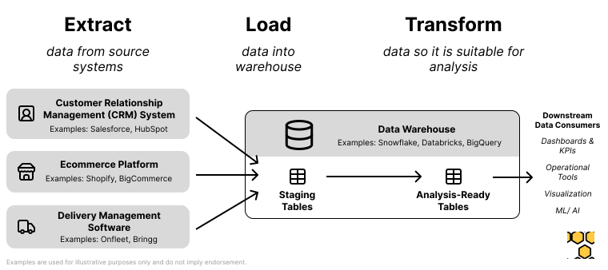

# Superstore Delivered

**Superstore Delivered** contains sample data and transformation logic for an online, delivery-first store.

This repository is meant to be used as a starting point for those implementing data warehouses within logistics, last-mile delivery, and mobility companies. All the data and code is open-source under the MIT License. 

You can find a step-by-step tutorial for building a data warehouse here: 

## Background 

If you work in the data industry you may be faimiliar with the ‘Superstore’ dataset from Tableau. The Superstore dataset contained data about the sales performance of a large big-box retailer, including tables like ‘customers’, ‘orders’, ‘products’, etc.

Fast-forward to 2024. Due to lasting changes in consumer behavior driven by the COVID-19 pandemic, Superstore Inc. has seen a dramatic fall in in-store sales. In response to this change in behavior, senior leadership made the decision to switch to a delivery-only business model. 


_Photo Credit: Claudio Schwarz, Unsplash_

While the migration itself was carried out successfully during the pandemic, the business is now struggling with the unit economics of deliveries. Many delivery failures are occurring, and the cost of labor and equipment for deliveries keeps rising. As the VP of Data, you have been asked to build a series of data products which provide insight into delivery performance.

## Repository Structure
```
.
├── README.md ** this file **
│
├── data
│   ├── csv - ** data in csv format **
│   └── parquet - ** data in parquet format **
│
├── data_generator
│   ├── generate_data.py
│   └── sample_addresses.csv
│
├── dbt - ** code for transforming data with dbt ** 
│
└── docs
    ├── diagrams
    └── images
```

## Downloading the data
You can download pre-generated data files directly from the `data` folder. Data is available in both CSV and Parquet files formats.

## Creating more data
The `data_generator` folder contains a Python script which produces the four data files. You can run it to create your own data:
```sh
python3 data_generator/generate_data.py
```

The file `sample_addresses.csv` contains address and latitude/longitude data from Travis County, Texas. This data is used to ensure realistic delivery points are generated. This data is sourced from the [Texas Geographic Information Office](https://tnris.org/stratmap/address-points.html) and is in the public domain. If you would like to generate sample data for another area, you can substitute this file for your own address data.

You can modify the variables within the `__main__` function in the `generate_data.py` to control the amount of data that is produced. 

## An overview of the ELT process
This repo is meant to emulate the data pipeline structure at a modern logistics or mobility company. It follows the [ELT (Extract, Load, Transform) pattern](https://www.ibm.com/topics/elt).



For a complete walkthrough of the ELT process, read the tutorial here: 

## Running the ELT process locally with dbt and DuckDB
1. Install dependencies
    - [Python](https://www.python.org/downloads/)
    - [DuckDB](https://duckdb.org/)
    - [dbt (Data Build Tool)](https://docs.getdbt.com/docs/core/installation-overview). _Note: it is suggested to build dbt within it's own virtual python environment with venv_.

2. Initialize the dbt project on your computer
    - `cd dbt`
    - `dbt init`

3. Configure your [dbt profiles.yml](https://docs.getdbt.com/docs/core/connect-data-platform/connection-profiles) file, using `dbt/profile_template.yml` as a template. You should not need to make any changes to the duckdb settings, but you will need to add your Snowflake credentials if you'd like to run dbt against Snowflake.

4. Run the dbt project locally using DuckDB
```sh
dbt run
```
_Note: the generated data has already been loaded into staging tables in the superstore_delivered.duckdb file for you. This means you can run the transformation logic directly. If you would like to load other data files into the database, you can use the `load_csv_data.sh` script._

You should see some output from dbt, ending with `Completed successfully. Done. PASS=11 WARN=0 ERROR=0 SKIP=0 TOTAL=11`.

**Congrats, you've just successfully built and ran a complete data warehouse on your computer!** 

5. Use the DuckDB CLI (Or a database client like DBeaver) to view the generated tables
```sh
duckdb superstore_delivered.duckdb
SHOW ALL TABLES;
SELECT * FROM metrics_by_h3 LIMIT 10;
```

6. (optional) Export the generated analytics tables to Parquet or CSV for visualization 
```sh
duckdb superstore_delivered.duckdb
SHOW ALL TABLES;
COPY metrics_by_h3 TO 'metrics_by_h3.parquet' (FORMAT PARQUET, COMPRESSION ZSTD); # compression can reduce file size significantly
COPY order_locations_delivery_success TO 'order_locations_delivery_success.csv' (HEADER, DELIMITER ',');
```

## Running the ELT process on Snowflake
Coming soon
